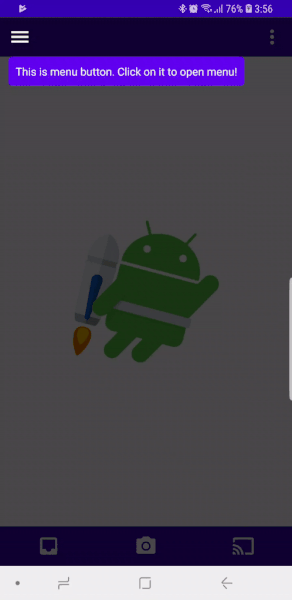

# Initial tips before using the app

Library was created for showing the initial tips for the user on the start of the app(e.g. highlighted button with the message text). 
There are several implementations of the animations or you can easily extend exist animation for your request



# Download

[](https://jitpack.io/#mpetlyuk/initial_tips)

## Gradle

#### Step 1:
Add it in your root build.gradle at the end of repositories:
```groovy
allprojects {
    repositories {
        maven { url 'https://jitpack.io' }
    }
}
```

#### Step 2:
Add the dependency
```groovy
dependencies {
    implementation 'com.github.mpetlyuk:initial_tips:$latest_version'
}
```

# Usage
1. Create view for your tip:
```kotlin
val inflater = LayoutInflater.from(Context)
val tipView = DataBindingUtil.inflate<ViewDataBinding>(inflater, R.layout.item_tooltip, null, false).getRoot()
/* Decorate your tip view according to your wishes */
```

2. Create tip:
```kotlin
val tip = ButtonTip.Builder()
    .attachTooltipView(tipView)
    .withEnterAnimation(AnimationComposer(FadeInAnimator()).duration(ANIM_DURATION))
    .withExitAnimation(AnimationComposer(FadeOutAnimator()).duration(ANIM_DURATION))
    .withPositionStrategy(TooltipFactory.createPositionStrategy(TooltipPosition.BOTTOM, TipGravity.LEFT))
    .withAnchorView(/* anchor view */)
    .buildTooltip()
```

3. Create a queue of tips:
```kotlin
val tooltipsQueue = LinkedBlockingQueue<Tip>(listOf(tip))
```

4. Show tips:
```kotlin
TipsManager.showTips(binding.root as ViewGroup) { tooltipsQueue }
```

# Feedback
I will be pleased to know if this library is useful to someone. I want to improve this library and fill with features. 
Especially if these features are needed by someone. That`s why feel free to create issues in the repo with 'enhancement' label.  


